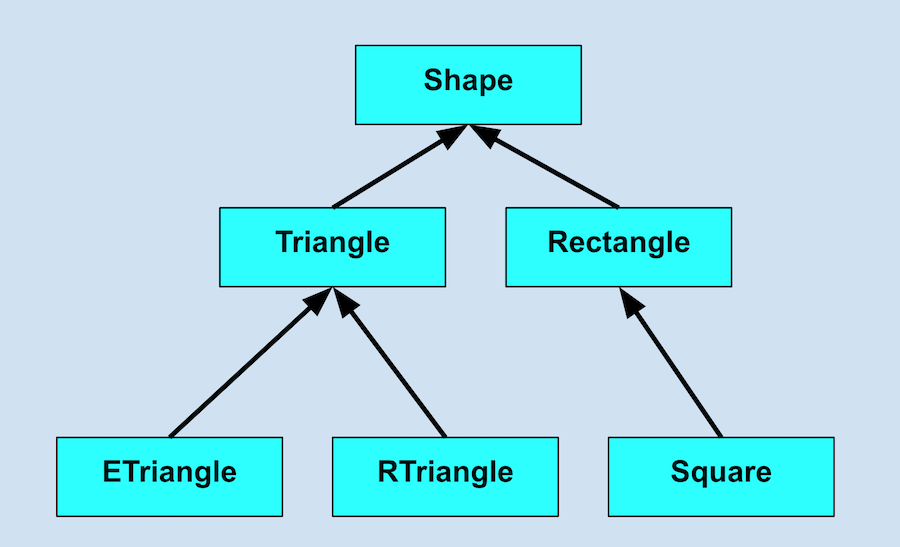

# Ruby Classes Lab

Complete this lab after the [Ruby classes lecture](https://git.generalassemb.ly/wdi-nyc-hamilton/LECTURE_U04_D02_Ruby_OOP)

## Let's create Shape classes!

We are building this hierarchy:

Get the tests to pass by editing the `src` files in the following order:

* `shape.rb`
* `rectangle.rb`
* `square.rb`
* `triangle.rb`
* `e_triangle.rb`
* `r_triangle.rb` (finished for you but take a look)

### Setup

If you have not yet done so

* `gem install bundler`
* `bundle install`

### Work

Look at the tests (but do not edit them).  Edit the files in the `src` directory and make the specs pass!

Do them **in order**:

* `rspec test/shape_spec.rb      --fail-fast`
* `rspec test/rectangle_spec.rb  --fail-fast`
* `rspec test/square_spec.rb     --fail-fast`
* `rspec test/triangle_spec.rb   --fail-fast`
* `rspec test/e_triangle_spec.rb --fail-fast`
* `rspec test/r_triangle_spec.rb --fail-fast`

If you cannot or prefer not to run the specs, just run `ruby sandbox.py` and look at the output.  Fix each failing line by editing the `src` directory

---

